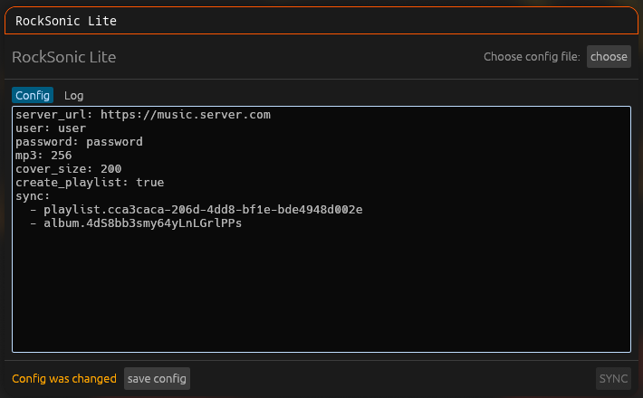
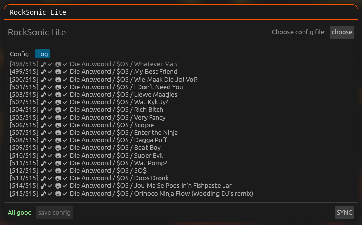

# rocksonic-lite

`rocksonic-lite` is a small Rust CLI and GUI that mirrors Subsonic playlists and albums to a local music library. It can:

- download original audio or request MP3 transcoding;
- store tracks as `<artist>/<album>/<track> <title>.<extension>`;
- download baseline JPEG cover art;
- remove embedded MP3 artwork;
- create M3U files for playlists; and
- use multiple download threads.

> [!NOTE]
> The GUI is rudimentary at this stage. More quality-of-life features are planned for future releases.

> [!WARNING]
> The tool treats its output directory as a mirror. It deletes files and directories that the current configuration does not select.

## GUI preview

| Configuration editor | Synchronization log |
| --- | --- |
|  |  |

## Requirements

- A current stable Rust toolchain
- A Subsonic-compatible server with API 1.16.1 support
- An HTTPS server URL to protect the password in transit

## Build

```sh
git clone https://github.com/koriwi/rocksonic-lite.git
cd rocksonic-lite
cargo build --release --bins --features gui
```

The CLI and GUI binaries are at `target/release/rocksonic-lite` and `target/release/rocksonic-lite-gui`.

## Release builds

GitHub Actions tests and builds both the CLI and GUI for each commit on Linux, macOS Intel, macOS Apple silicon, and Windows. Push a `v*` tag to create a release for its commit:

```sh
git tag v0.1.0
git push origin v0.1.0
```

The release contains four platform archives and a `SHA256SUMS` file. Each archive contains both the CLI and GUI binaries.

## Configure

Create `music.yaml`:

```yaml
server_url: https://music.example.com
user: alice
password: change-me
upgrade_songs: false
upgrade_covers: false
cover_size: 300
create_playlist: true
threads: 4
sync:
  - playlist.2f34a8c1
  - album.97bc21de
```

| Key | Meaning | Default |
| --- | --- | --- |
| `server_url` | Server base URL, without `/rest` | Required |
| `user` | Subsonic user name | Required |
| `password` | Subsonic password | Required |
| `mp3` | Optional MP3 bitrate in kbit/s | Original format |
| `upgrade_songs` | Replace existing MP3 files when their bitrate differs from `mp3` by more than 10% | `false` |
| `upgrade_covers` | Replace existing covers when their width differs from `cover_size` by more than 10% | `false` |
| `cover_size` | Cover width in pixels | `300` |
| `create_playlist` | Create an M3U file for each selected playlist | `true` |
| `threads` | Number of download threads | `4` |
| `sync` | Entries in `playlist.<id>` or `album.<id>` form | Required |

The tool creates M3U files only for `playlist.<id>` entries. It does not create them for `album.<id>` entries.

Protect the configuration file. It contains the password as plain text.

## Use

Run through Cargo:

```sh
cargo run --release -- --config ./music.yaml
```

Or run the CLI binary:

```sh
./target/release/rocksonic-lite --config ./music.yaml
```

Run the GUI with:

```sh
./target/release/rocksonic-lite-gui
```

The tool downloads original audio when you omit `mp3` or set it to `null`. To request MP3 transcoding at 256 kbit/s, set:

```yaml
mp3: 256
```

By default, the tool keeps songs and covers that already exist. Set `upgrade_songs: true` to check existing MP3 files against the configured `mp3` bitrate and replace files outside the 10% tolerance. This flag has no effect when `mp3` is omitted or `null`. Set `upgrade_covers: true` to check existing covers against `cover_size` and replace covers outside the 10% tolerance.

> [!NOTE]
> These upgrade checks make synchronization slower. Without them, the tool only checks whether each destination path exists. With them enabled, it must also open and inspect every existing song or cover to read its bitrate or image width. Files outside the tolerance then take additional time to download again.

The configuration name sets the library path. For example, `./music.yaml` creates `./music/`. The tool writes playlist M3U files to the current directory.

## Disclaimer

I wrote the Rust code without vibe coding. I used vibe coding for this README and the CI workflow.
